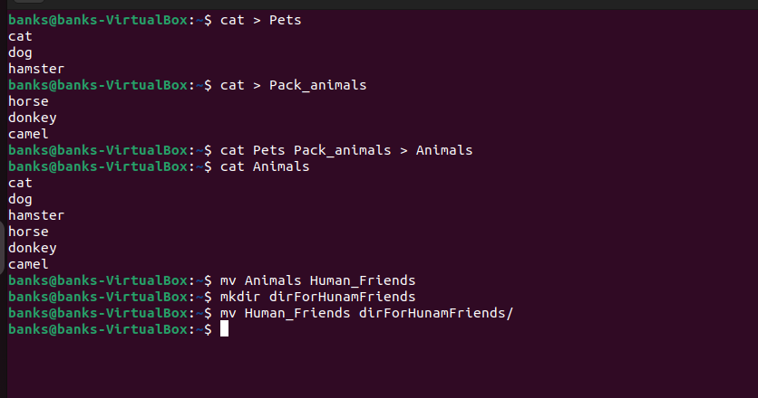
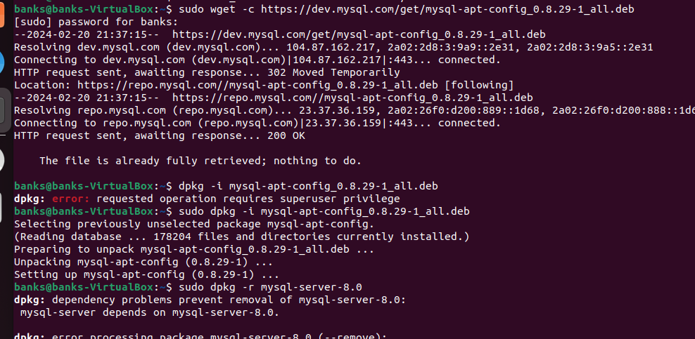

* Начинаю итоговую работу по блоку "Разработчик"

## Linux

### Задание 1 
Используя команду cat в терминале операционной системы Linux, создать два файла Домашние животные (заполнив файл собаками, кошками, хомяками) и Вьючные животными заполнив файл Лошадьми, верблюдами и ослы), а затем объединить их. Просмотреть содержимое созданного файла. Переименовать файл, дав ему новое имя (Друзья человека).

### Задание 2
Создать директорию, переместить файл туда.

### Задание 3
Подключить дополнительный репозиторий MySQL. Установить любой пакет из этого репозитория.

### Задание 4
Установить и удалить deb-пакет с помощью dpkg.

### Задание 5
Выложить историю команд в терминале ubuntu. 
## _Файл с историей - см. file-history.pdf_

### Задания 6 - 12
Нарисовать диаграмму, в которой есть класс родительский класс, домашние животные и вьючные животные, в составы которых в случае домашних животных войдут классы: собаки, кошки, хомяки, а в класс вьючные животные войдут: Лошади, верблюды и ослы). 
## _Файл с решениями задач по SQL - в файле animal-sql._

# Java:
Написать программу, имитирующую работу реестра домашних животных.
### _Разработка лежит в каталоге Animals_program._

